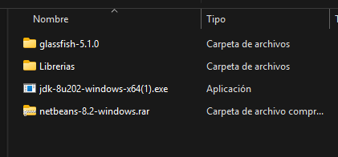
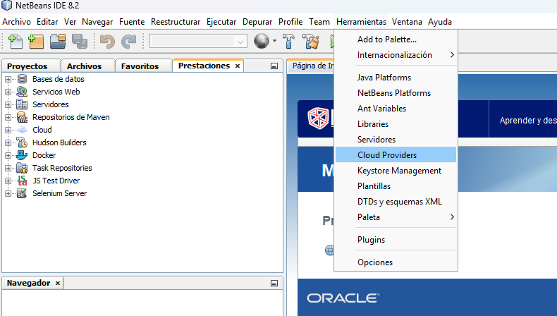
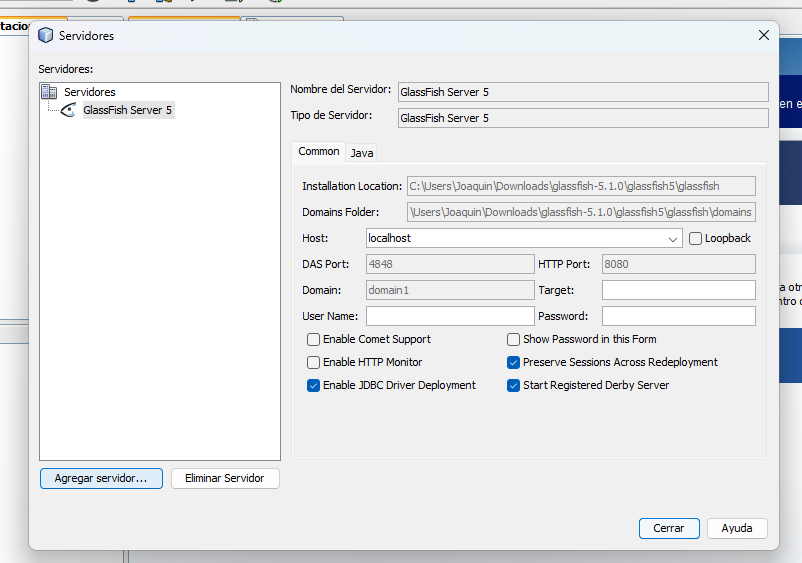
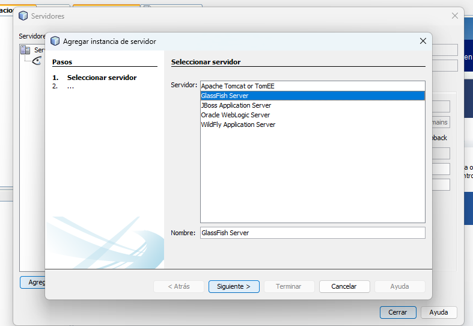
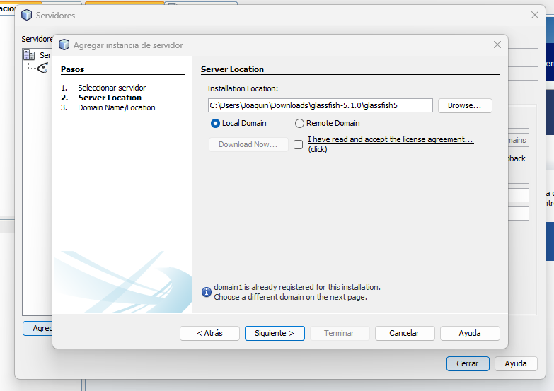
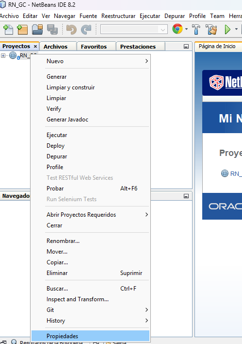
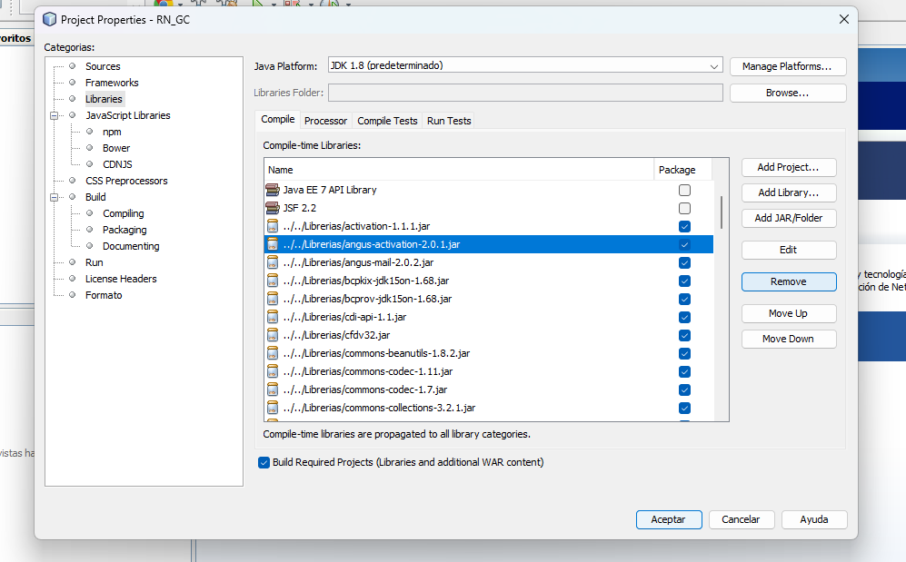
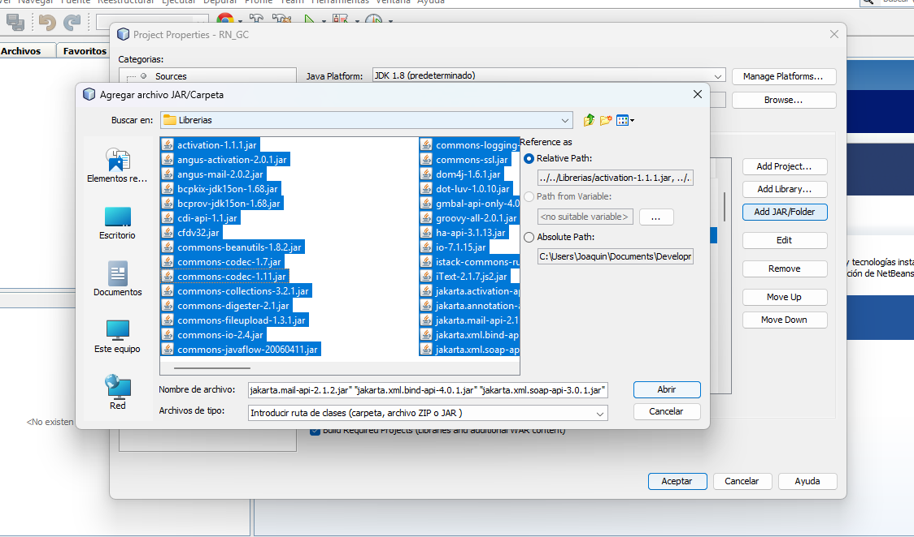
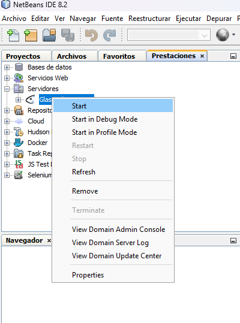
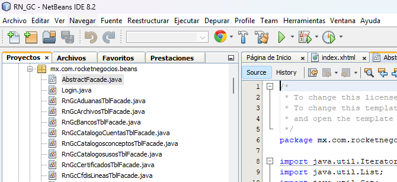

# 📊 Proyecto de Contaduría

Este proyecto está diseñado para gestionar la **contabilidad** de una organización. Incluye diversas funcionalidades clave como:

- 🧾 **Facturación**
- 👨‍💼 **Nómina**
- 📘 **Gestión de cuentas**
- 📂 **Reportes financieros**
- Entre otras funciones administrativas y contables.

---

## 🚀 Cómo levantar el proyecto

### 1. Requisitos previos

Antes de comenzar, necesitas tener instalados los siguientes componentes:

- ✅ **Java JDK 8**
- ✅ **NetBeans IDE**
- ✅ **GlassFish Server 5.1.0** (ya configurado)

Puedes descargar todo el paquete necesario desde el siguiente enlace:

📥 [Descargar instaladores y librerías](https://drive.google.com/file/d/1WDedZkH4ToI9tgNrBQubzvgTnEp_RYBj/view?usp=drive_link)

## 

### 2. Instalación de Java y NetBeans

1. Instala **Java JDK 8** usando el instalador proporcionado.
2. Instala **NetBeans IDE**, incluido en el paquete.
3. Verifica que NetBeans reconozca correctamente el JDK instalado.

---

### 3. Agregar el servidor GlassFish a NetBeans

1. Abre NetBeans y ve a la pestaña **Herramientas**.
   
2. Clic derecho en **Servidores** → **Agregar servidor**.
   
3. Selecciona **GlassFish Server** y haz clic en **Siguiente**.
   
4. En la ruta de instalación, selecciona la carpeta de GlassFish incluida en el paquete descargado.
   

---

### 4. Configuración de librerías del proyecto

1. Abre el proyecto en NetBeans.
2. Haz clic derecho sobre el nombre del proyecto → **Propiedades** → **Librerías**.
   
3. **Elimina** todas las librerías que NetBeans haya añadido por defecto.
   
4. **Agrega** todas las librerías (`.jar`) que se encuentran en la carpeta `Librerias` descargada desde el enlace proporcionado:
   - Haz clic en **Agregar JARs/Carpeta...**
   - Selecciona todos los archivos `.jar` dentro de la carpeta `Librerias`.

---

## 🖨️ Generación de archivos PDF

Este proyecto utiliza **iReport Designer 5.6.0** para el diseño de reportes y generación de archivos PDF.  
Los archivos `.jasper` generados por iReport se integran en el sistema y son utilizados para:

- Generar facturas
- Recibos de nómina
- Reportes contables

📥 [Descargar iReport 5.6.0](https://drive.google.com/file/d/1zmsjEoQgFwUvjutma-NPUCsq3Nu15Gwd/view?usp=sharing)

---

## ✅ ¡Listo!

Una vez realizados estos pasos, ya puedes ejecutar el proyecto desde NetBeans.

1. Levantar el servidor de GlassFish.
   
   
2. Ejecutar el proyecto.
   
   

---

## 📌 Notas adicionales

- El proyecto utiliza tecnologías Java EE con el servidor GlassFish.
- Las configuraciones de base de datos se encuentran en el archivo `persistence.xml`.

---
